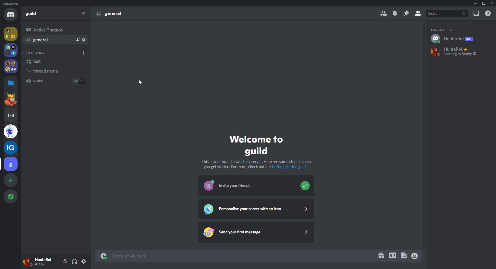

<a href="https://www.npmjs.com/@hunteroi/discord-server-generator"></a>
<a href="https://www.npmjs.com/@hunteroi/discord-server-generator"></a>

# Discord Server Generator

Discord Server Generator is a framework which allows you to create your server based on a JSON configuration acting like the server template.

- Supports threads, custom emojis and stickers
- Emits events like `guildGenerate`, `channelCreate`, `roleCreate` and **9 more**!
- And much more!



See [./example/index.js](./example/index.js).

## Prerequisites ⚠️

You must use **NodeJS v16.6.0 or higher** to run a bot with this library.

You must also not forget to include [mandatory intents](#mandatory-intents) as well as give your bot the rights to use application commands. You might add [optional intents](#optional-intents) if you feel like it.

As another logical note, it is mandatory that your bot's role is the highest in the guild in order for it to remove all roles from the guild's roles pool.

### Mandatory intents

- GUILDS: used to access guild content such as channels.

### Optional intents

- GUILD_EMOJIS_AND_STICKERS: use to access and add guild emojis and stickers.

## Installation

```sh
npm install --save @hunteroi/discord-server-generator
```

## Events

```ts
manager.on(
  ServerGeneratorManagerEvents.guildGenerate,
  (guild: Guild, options: GuildOptions) => {}
);

manager.on(
  ServerGeneratorManagerEvents.guildGenerated,
  (guild: Guild, options: GuildOptions) => {}
);

manager.on(ServerGeneratorManagerEvents.roleDelete, (role: Role) => {});

manager.on(
  ServerGeneratorManagerEvents.channelDelete,
  (channel: GuildChannel) => {}
);

manager.on(ServerGeneratorManagerEvents.emojiDelete, (emoji: GuildEmoji) => {});

manager.on(
  ServerGeneratorManagerEvents.stickerDelete,
  (sticker: Sticker) => {}
);

manager.on(
  ServerGeneratorManagerEvents.channelCreate,
  (channel: GuildChannel, options: CategoryOptions | GuildChannelOptions) => {}
);

manager.on(
  ServerGeneratorManagerEvents.threadCreate,
  (thread: ThreadChannel, options: ThreadOptions) => {}
);

manager.on(
  ServerGeneratorManagerEvents.roleCreate,
  (role: Role, options: RoleOptions) => {}
);

manager.on(
  ServerGeneratorManagerEvents.emojiCreate,
  (emoji: GuildEmoji, options: EmojiOptions) => {}
);

manager.on(
  ServerGeneratorManagerEvents.stickerCreate,
  (sticker: Sticker, options: StickerOptions) => {}
);
```

## Contribution

Contributions are what make the open source community such an amazing place to be learn, inspire, and create. Any contributions you make are greatly appreciated.

1. Fork the Project
2. Create your Branch: `git checkout -b patch/YourAmazingWork`
3. Commit your Changes: `git commit -m 'Add some amazing work'`
4. Push to the Branch: `git push origin patch/YourAmazingWork`
5. Open a Pull Request
